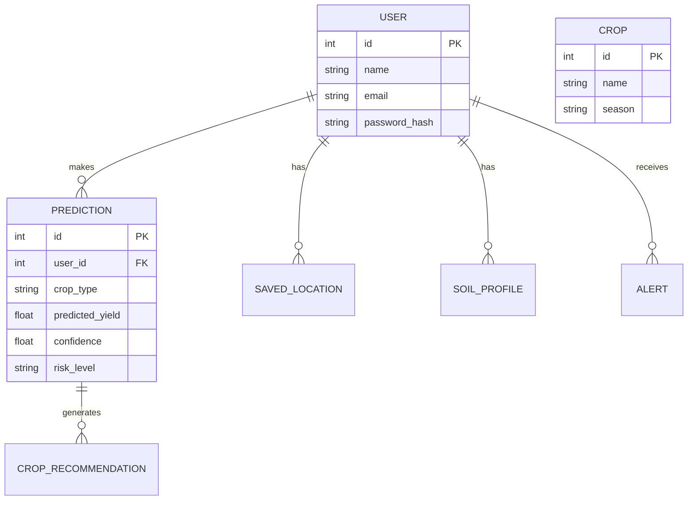

# YieldX

## AI-Based Crop Yield Prediction & Smart Farming Decision Support Platform

YieldX is an AI-powered crop yield prediction platform that leverages machine learning and modern web technologies to help farmers, researchers, and agricultural organizations make informed farming decisions. By combining agricultural data, weather information, and predictive analytics, the platform delivers accurate crop yield predictions, intelligent crop recommendations, and interactive analytical insights through a secure web application.

Agriculture is highly dependent on environmental factors such as rainfall, temperature, humidity, and soil conditions. Traditional farming methods often rely on assumptions and historical experience, resulting in inefficient resource utilization and financial losses. YieldX addresses these challenges by integrating Artificial Intelligence, Machine Learning, and real-time weather information into a centralized decision-support platform.

The system follows a modular full-stack architecture consisting of a React frontend, Flask REST APIs, SQL databases, and a hybrid machine learning engine powered by XGBoost and Random Forest models.

---

## Vision

To build a scalable and intelligent agricultural decision-support platform that enables data-driven farming through accurate yield prediction, weather-aware recommendations, and predictive analytics.

---

## Problem Statement

Modern agriculture faces several operational challenges that directly impact productivity and profitability:

- Unpredictable weather conditions affecting crop growth.
- Difficulty selecting suitable crops for varying soil and climate conditions.
- Lack of reliable crop yield prediction systems.
- Inefficient utilization of water, fertilizers, and farming resources.
- Limited access to intelligent decision-support tools.
- Insufficient analytical insights for long-term agricultural planning.

YieldX addresses these challenges through predictive analytics, weather intelligence, and machine learning.

---

## Key Features

- Secure JWT-based authentication with rate-limited login and registration endpoints
- AI-powered crop yield prediction with server-side input validation
- Crop recommendation engine, gated behind a completed yield prediction so recommendations are always grounded in real soil data
- Weather forecast integration with seasonal-average fallback
- Historical prediction tracking
- Interactive, per-crop analytics dashboard with region-aware benchmarking
- Confidence score generation
- Risk level analysis
- Regional and seasonal analytics, verified against case-sensitivity and multi-user aggregation edge cases
- Farmer-facing measurements in acres, converted internally to hectares for the ML pipeline
- Guided input tooltips explaining soil parameters and typical agronomic ranges
- RESTful API architecture
- Responsive web interface with a custom design system (no UI framework)

---

## Technology Stack

| Category | Technologies |
|:---------|:-------------|
| **Frontend** |  Chart.js (`react-chartjs-2`), Axios, Formik, Yup, custom CSS design system |
| **Backend** |  Flask Blueprints, Flask-SQLAlchemy, Flask-JWT-Extended, Flask-Limiter, Flask-Migrate, RESTful APIs |
| **Machine Learning** | XGBoost, Random Forest, Scikit-learn, Pandas, NumPy, Joblib |
| **Database** |  SQLAlchemy ORM, Alembic migrations |
| **External Services** | OpenWeatherMap API, Google Maps Geocoding API, IPInfo API, Mock Weather Fallback |
| **Testing** | Pytest (backend), Vitest + React Testing Library (frontend) |
| **DevOps** |  |

---

## Setup & Installation

### Prerequisites

- Python 3.9+
- Node.js 18+
- MySQL 8.0+ or Docker Desktop
- OpenWeatherMap API Key (Free tier)

### Docker Setup (Recommended)

1. Clone the repository and navigate to the project root.
2. Copy `.env.example` to `.env` and fill in your credentials:
   ```bash
   cp .env.example .env
   ```
3. Run the following command to start all services (MySQL, Flask Backend, React Frontend via Nginx):
   ```bash
   docker-compose up --build -d
   ```
4. Access the application at `http://localhost:80` (or `http://localhost:5173` depending on port mappings).

### Manual Setup

#### 1. Database
1. Start your local MySQL server.
2. Create the database and load the schema:
   ```bash
   mysql -u root -p -e 'CREATE DATABASE yieldx;'
   mysql -u root -p yieldx < backend/schema.sql
   ```

#### 2. Backend (Flask)
1. Navigate to the `backend` directory.
2. Create a virtual environment and activate it.
3. Install dependencies:
   ```bash
   pip install -r requirements.txt
   ```
4. Start the Flask server:
   ```bash
   python run.py
   ```

#### 3. Machine Learning Pipeline
1. Navigate to the `ml` directory.
2. Create a virtual environment, activate it, and install dependencies (`pip install -r requirements.txt`).
3. Run the training script to generate the models:
   ```bash
   python train.py
   ```

#### 4. Frontend (React)
1. Navigate to the `frontend` directory.
2. Install dependencies (`npm install`).
3. Start the Vite development server (`npm run dev`).

---

## System Architecture

YieldX follows a modular three-tier architecture.

- React + Vite provides the client-side user interface, styled with a custom "Modern Agriculture" design system rather than a UI framework.
- Flask REST APIs handle authentication, business logic, rate limiting, and communication with the machine learning engine.
- JWT authentication secures all protected endpoints, with brute-force protection via rate limiting on login and registration.
- XGBoost and Random Forest models perform crop yield prediction and recommendation; trained models are cached in memory after first load rather than reloaded from disk on every request.
- SQLAlchemy manages persistent data using SQLite during development and MySQL for production, with schema evolution handled by Flask-Migrate/Alembic.
- Weather information is retrieved through the OpenWeatherMap API with automatic fallback to mock weather data when required.

This architecture enables scalability, maintainability, and independent evolution of each system component.

---

## Database Architecture

### Entity Relationship Diagram


### Key Tables

- **users**: Stores authentication credentials, profile data, and farm metrics (e.g., `farm_size`, `preferred_crops`).
- **predictions**: Stores user-submitted inputs (NPK, weather, soil type) and generated ML inference outputs (yield, confidence, risk level).

### Data Flow & Migrations
- **Data Flow**: Users submit predictions using acres. The frontend silently converts `area_acres` to `area_hectares` using a utility module. The backend persists the data, passes it to the Scikit-learn pipeline, and returns `kg/ha`, which is visually mapped back to `kg/acre` for the user.
- **Migrations**: Database schema evolution is managed strictly via Alembic (`Flask-Migrate`). `flask db upgrade` is the definitive source of truth for applying schemas.

---

## Machine Learning Pipeline

1. Agricultural Dataset Collection
2. Data Cleaning and Preprocessing
3. Feature Engineering
4. Model Training
5. Hybrid Model Inference
6. Yield Prediction
7. Confidence Score Generation
8. Risk Assessment
9. Prediction Storage

### Model Performance

#### XGBoost

| Metric | Value |
|---------|-------|
| MAE | 1363.45 kg/ha |
| RMSE | 2327.97 kg/ha |
| R² Score | 0.9253 |
| MAPE | 31.05% |

#### Random Forest

| Metric | Value |
|---------|-------|
| R² Score | 0.9354 |

The hybrid inference pipeline combines XGBoost and Random Forest models to improve prediction reliability and overall performance.

---

## Security Review

### Hardened Configuration
- **Environment Variables**: `SECRET_KEY` and `JWT_SECRET_KEY` are mandatory on startup (no insecure fallbacks). The backend fails safely if they are missing.
- **CORS**: Tightly scoped to `FRONTEND_URL` rather than wildcard `*`.
- **Rate Limiting**: Applied to authentication endpoints (e.g., 5/minute for login/register) to prevent brute-force attacks.
- **Validation**: Strict server-side length validation applied on registration (e.g., passwords must be >= 8 chars).

### Known Security Limitations
- The `flask_limiter` uses the default memory storage. In a multi-worker production environment (e.g., Gunicorn), this is ineffective and allows requests to bypass limits. Redis is heavily recommended for production.
- JWTs are currently stored in `localStorage`. Migrating to `httpOnly` cookies is planned.

---

## Design System

The application relies on a custom "Modern Agriculture" CSS design system (`tokens.css` and `base.css`), entirely dropping external UI frameworks like Bootstrap.

- **Palette**: 
  - *Backgrounds*: Mist (`#F8FAF5`) for page backgrounds, Surface (`#FFFFFF`) for cards.
  - *Primary*: Forest (`#2E7D32`) for primary buttons and sidebar backgrounds.
  - *Secondary*: Fern (`#66BB6A`) for charts and hover states.
- **Typography**: Display headings use `Fraunces` (serif), body text uses `Inter` (sans-serif), and numerical data uses `IBM Plex Mono`.
- **Components**: 
  - Forms use controlled inputs, explicit text colors (to prevent dark-mode OS overrides), and an 8px border radius.
  - Custom UI elements include a `SoilStrip` component for visual soil health context, and floating `Tooltip` overlays for agricultural metrics.

---

## Available Modules

### Authentication
- User Registration
- Login
- JWT Authentication
- Profile Management
- Password Management (with clear success/error feedback on change)

### Prediction
- Crop Yield Prediction
- Crop Recommendation
- Confidence Score
- Risk Level Assessment

### Weather
- Current Weather
- Weather Forecast
- Mock Weather Support

### Analytics
- Summary Dashboard
- Regional Analytics
- Seasonal Analytics
- Crop Ranking

### Alerts
- Risk Notifications
- Alert Management

### History
- Historical Predictions
- User Prediction Records

---

## REST API Overview

Base URL: `/api`

### Authentication (`/api/auth`)
- `POST /register`: Register a new farmer account
- `POST /login`: Login and receive JWT access token
- `GET /profile`: Get authenticated user’s profile (Requires JWT)
- `PUT /profile`: Update user profile (Requires JWT)
- `POST /change-password`: Change password (Requires JWT)

### Prediction (`/api/predict`)
- `POST /yield`: Submit inputs; returns yield, confidence, risk, and recommendations (Requires JWT)
- `POST /crop`: Get top-3 crop recommendations for given soil/season (Requires JWT)
- `GET /history`: Paginated prediction history with filters (Requires JWT)
- `GET /{id}`: Full details of a specific prediction (Requires JWT)

### Crops (`/api/crops`)
- `GET /`: List all supported crops
- `GET /{id}`: Crop by numeric ID
- `GET /name/{name}`: Crop by name

### Weather (`/api/weather`)
- `GET /{location}`: Fetch current weather (Requires JWT)
- `GET /forecast/{location}`: 5-day weather forecast (Requires JWT)

### Analytics (`/api/analytics`)
- `GET /region`: Regional yield stats by state/crop (Requires JWT)
- `GET /seasonal`: Seasonal analytics Kharif/Rabi/Zaid (Requires JWT)
- `GET /crop-ranking`: Top crops by avg yield for a region (Requires JWT)
- `GET /summary`: User summary — totals, top crop, avg yield (Requires JWT)

### Alerts (`/api/alerts`)
- `GET /`: Retrieve risk notifications and alerts (Requires JWT)

### Health (`/api/health`)
- `GET /`: API health — status, DB connection, and ML model load status

---

## Design Principles

- Modular Architecture
- Secure Authentication
- RESTful API Design
- Scalable Machine Learning Pipeline
- Separation of Concerns
- Maintainable Codebase
- Production-Ready Deployment
- Extensible System Design

---

## Current Status

### Completed

- Authentication System (hardened: rate limiting, server-side password validation, no insecure fallback secrets)
- Crop Yield Prediction (with server-side input validation)
- Crop Recommendation (with prediction-history gating)
- Weather Integration
- Analytics Dashboard (region-matching verified against edge cases: missing fields, whitespace, casing, multi-user aggregation)
- Prediction History
- JWT-Protected APIs
- Responsive React Frontend with a custom design system
- Automated Test Suite (19 backend pytest cases, 22 frontend Vitest cases)
- Full manual QA pass via browser automation, covering the complete user flow end to end
- File-by-file code review and a static security audit, both documented in `CODE_REVIEW.md`

### Planned Enhancements

- Prediction Deletion API
- Weather Response Caching
- Advanced Model Health Monitoring
- Performance Optimization (current prediction inference takes approximately 30 seconds under local testing conditions)
- Redis-backed rate limiting for multi-worker production deployments
- Migration from localStorage-based JWT storage to httpOnly cookies

---

## Known Limitations & Missing Documentation

- **Assumptions**: The system assumes the user understands the inputs require strict Metric units internally. The UI converts Acres to Hectares silently, which could cause confusion if interacting directly with the API.
- **Risks**: The SQLite fallback database is still present for local testing, but MySQL is strongly recommended. Rate limiting relies on in-memory mapping which limits horizontal scaling.
- **Refactoring Opportunities**: The dense rules engine in `predict_routes.py` (for crop suitability Euclidean math and weather fallbacks) could be extracted into a dedicated `services/` directory layer.

---

## Future Scope

- Deep Learning models for advanced forecasting
- Satellite imagery integration
- IoT-based soil monitoring
- Fertilizer recommendation engine
- Smart irrigation planning
- React Native mobile application
- Multi-language support
- Kubernetes-based cloud deployment
- AI-powered pest and disease prediction
- Precision agriculture analytics