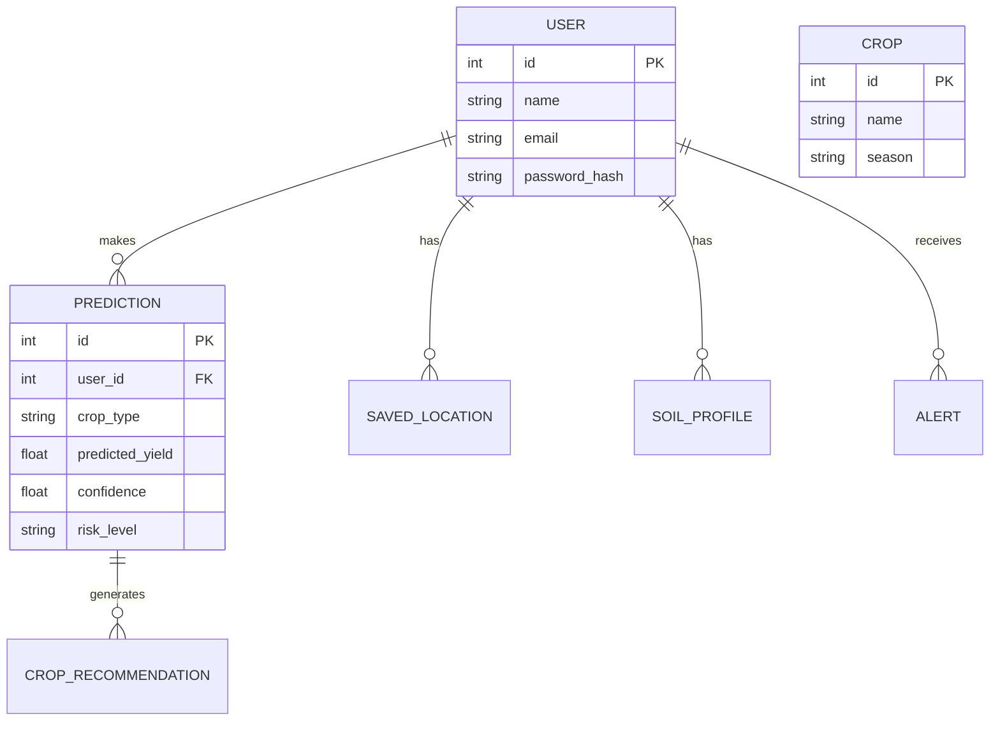
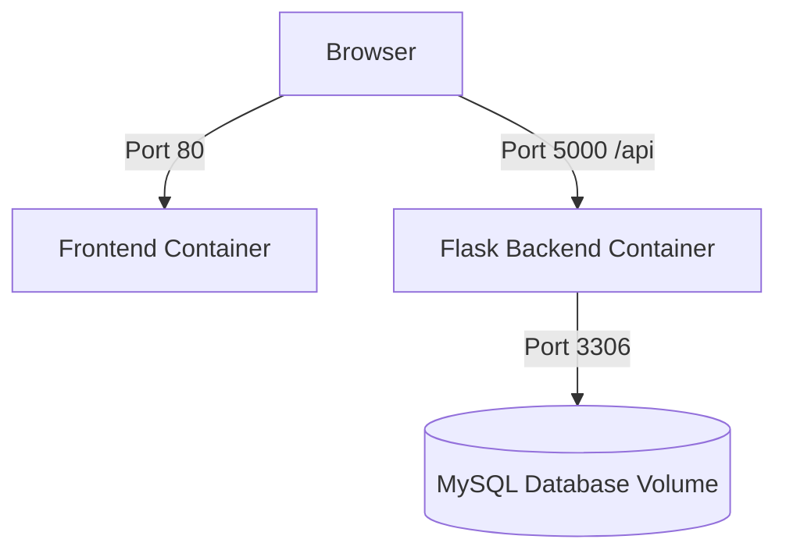

# Changelog (Reconciliation Pass)

- **[UPDATED] API: POST /api/auth/register** — Added rate limiting (5 per minute) and server-side minimum password length validation (`backend/routes/auth_routes.py:16`).
- **[UPDATED] API: POST /api/auth/login** — Added rate limiting (5 per minute) (`backend/routes/auth_routes.py:46`).
- **[UPDATED] Security Review** — Insecure default `SECRET_KEY` and `JWT_SECRET_KEY` fallbacks were removed; the backend now fails safely at startup if missing. CORS is restricted to `FRONTEND_URL` rather than wildcard (`backend/config.py:7`, `backend/backend_app.py:18`).
- **[UPDATED] Database: docker-compose.yml** — Removed insecure fallback passwords for `MYSQL_ROOT_PASSWORD`.
- **[UPDATED] API: GET /api/analytics/*** — Broad exception handling fixed to avoid leaking server errors to the client by logging them server-side instead (`backend/routes/analytics_routes.py`).
- **[UPDATED] Business Logic: ml/predict.py** — ML models are now loaded lazily and cached globally to prevent disk reads on every prediction request (`ml/predict.py:15`).
- **[REMOVED] Code Quality Review: Technical debt** — The note about JWT Secret Key length being dangerously short was removed, as the app now forces the user to supply a secure key via environment variables.
- **[UPDATED] Rebuild Guide** — `.env` now requires `DB_PASSWORD`, `SECRET_KEY`, and `JWT_SECRET_KEY` with no fallbacks.
- **[NEW] Page: /alerts** — The AlertsPage was implemented in the frontend routing but undocumented in the list of pages (`frontend/src/App.jsx:43`).
- **[UPDATED] Page: /recommend** — Added prediction gating to ensure a user has completed a prediction before rendering the recommendation form (`frontend/src/pages/RecommendPage.jsx:14`).
- **[UPDATED] Page: /dashboard** — The Dashboard chart was updated to use dynamically resolved theme CSS variables rather than black, and it now supports filtering trends by specific crop types (`frontend/src/pages/DashboardPage.jsx:40`).
- **[UPDATED] Design System: Global Styling** — Explicit text colors were added to form inputs and headings to fix a bug causing text to render invisibly on specific backgrounds (`frontend/src/styles/base.css`).
- **[UPDATED] Data Flow** — The explicit creation of `frontend/src/utils/unitConversion.js` for `acresToHectares` and `hectaresToAcres` is noted.

---

# 1. Executive Summary
- **Project name**: YieldX
- **Purpose**: YieldX is an intelligent precision agriculture platform designed to predict crop yields, recommend suitable crops, and provide data-driven insights based on soil health, weather patterns, and agronomic practices.
- **Main features**: 
  - Crop Yield Prediction via an XGBoost/Random Forest ensemble model.
  - Crop Recommendation Engine based on Euclidean distance of soil characteristics.
  - Real-time Weather Integration for localized predictions.
  - Soil Profile & Account Management.
  - User Dashboard with Historical Analytics and charts.
  - Alerts and Notifications System.
- **Target users**: Farmers, Agronomists, and Agricultural Planners.
- **Business workflow**: User registers/logs in → Configures farm profile (soil parameters, location) → Submits prediction requests for upcoming seasons → Views yield forecasts and confidence scores → Tracks historical performance and trends over time via the analytics dashboard.
- **Technology stack**: 
  - **Frontend:** React 19, Vite, React Router DOM, Chart.js, Formik.
  - **Backend:** Python, Flask 3, Flask-SQLAlchemy, JWT Authentication.
  - **Machine Learning:** Scikit-learn, XGBoost, Pandas.
  - **Database:** MySQL 8.0 / SQLite (fallback) with Flask-Migrate (Alembic) migrations.
  - **Infrastructure:** Docker, Docker Compose, Nginx.

---

# 2. Repository Structure
```text
YieldX/
├── backend/
│   ├── migrations/      # Alembic migration scripts
│   ├── routes/          # API route controllers
│   ├── tests/           # Pytest test suites
│   ├── backend_app.py   # Flask app factory, middlewares, global error handlers
│   ├── config.py        # Environment loader
│   ├── models.py        # SQLAlchemy ORM models
│   ├── requirements.txt # Python dependencies
│   ├── run.py           # Backend entry point
│   ├── schema.sql       # Reference SQL schema
│   └── seed_db.py       # Developer database seeding script
├── frontend/
│   ├── public/          # Static assets
│   ├── src/
│   │   ├── assets/      # Images and icons
│   │   ├── components/  # Reusable UI components
│   │   ├── context/     # React Context providers
│   │   ├── pages/       # React Router views
│   │   ├── services/    # Axios HTTP clients
│   │   ├── styles/      # Global CSS tokens and resets
│   │   ├── utils/       # Utility functions (unit conversions)
│   │   ├── App.jsx      # Routing configuration
│   │   └── main.jsx     # Frontend entry point
│   ├── .env.example     # Environment template
│   └── package.json     # Node dependencies and scripts
├── ml/
│   ├── data/            # Datasets for training (yield.csv, Crop_Recommendation.csv)
│   ├── models/          # Pickled scikit-learn/xgboost models
│   ├── predict.py       # Inference script handling data transformations
│   └── train.py         # Model training and pipeline generation script
├── docker-compose.yml   # Multi-container orchestration
├── Dockerfile.backend   # Backend image definition
├── Dockerfile.frontend  # Frontend image definition
└── .gitignore           # Git ignore rules
```

- **Purpose of every folder**:
  - `backend/`: Houses all server-side logic, database interaction, API routing, and security.
  - `frontend/`: Houses the Vite/React single page application for the presentation layer.
  - `ml/`: Houses datasets, pickled models, and python scripts exclusively dedicated to machine learning pipelines.
- **Architecture overview**: YieldX uses a standard 3-tier architecture. A React frontend communicates via REST to a Flask backend. The backend manages state via MySQL and delegates heavy inference tasks to pickled models using the `ml/predict.py` service layer.
- **Dependency map**:
  - `Frontend` depends on `Backend` (via REST API over port 5000).
  - `Backend` depends on `MySQL` (port 3306), `ml/models` (filesystem).
  - `ml/predict.py` depends on `xgboost` and `scikit-learn` in the Python environment.

---

# 3. Frontend Analysis

## 3.1 Frontend Architecture
- **Framework used**: React 19 bootstrapped with Vite.
- **State management**: React Context API (`AuthContext`) for auth state; local component state (`useState`) for transient form state.
- **Routing structure**: `react-router-dom` v7 with a central `App.jsx` layout wrapper for ProtectedRoutes.
- **Component hierarchy**: `main.jsx` → `App.jsx` → `AuthProvider` → `Router` → `Routes` → `ProtectedRoute` → `Layout` → (Specific Page Component).
- **Reusable components**: `Layout`, `Sidebar`, `Aurora`, `AnimatedList`, `SoilStrip`, `Tooltip`, `CountUp`.
- **Design patterns**: Composition for layouts, Context for global auth state, controlled inputs (via Formik) for forms, CSS Variables for theming.

## 3.2 Screens & Pages

### LoginPage
- **Route**: `/login`
- **Purpose**: Authenticate returning users.
- **User actions**: Enter email and password.
- **Components used**: HTML forms, CSS modules.
- **Data sources**: `POST /api/auth/login`

### RegisterPage
- **Route**: `/register`
- **Purpose**: Register new accounts.
- **User actions**: Enter name, email, password, confirm password.
- **Components used**: HTML forms.
- **Data sources**: `POST /api/auth/register`

### DashboardPage
- **Route**: `/dashboard`
- **Purpose**: High-level overview of farm metrics and recent weather.
- **User actions**: View metrics.
- **Components used**: `Chart.js` (Line chart with dynamic CSS variables and crop filtering).
- **Data sources**: `GET /api/analytics/trends`, `GET /api/weather/live`

### PredictPage
- **Route**: `/predict`
- **Purpose**: Step-by-step wizard to collect farm data for ML inference.
- **User actions**: Input Nitrogen, Phosphorus, Potassium, pH, Area, Crop type, etc.
- **Components used**: `Formik`, `SoilStrip`, `Tooltip`.
- **Data sources**: `POST /api/predict/yield`

### ResultsPage
- **Route**: `/results/:id`
- **Purpose**: Display prediction output (yield, confidence) and recommendations.
- **User actions**: View data, navigate back to history.
- **Components used**: `CountUp`, `AnimatedList`, `Doughnut` (Chart.js).
- **Data sources**: `GET /api/predict/:id`

### RecommendPage
- **Route**: `/recommend`
- **Purpose**: Crop recommendation engine based on NPK and pH values.
- **User actions**: View gating prompt if no prediction exists. Enter soil attributes to receive crop recommendations.
- **Components used**: `Formik`, `Tooltip`, `AnimatedList`.
- **Data sources**: `POST /api/predict/crop`

### HistoryPage
- **Route**: `/history`
- **Purpose**: Log of historical inferences.
- **User actions**: Export to PDF, view past logs.
- **Components used**: `jsPDF`, `jspdf-autotable`.
- **Data sources**: `GET /api/predict/history`

### AnalyticsPage
- **Route**: `/analytics`
- **Purpose**: Regional data analysis comparing crop yields.
- **User actions**: View bar charts.
- **Components used**: `Bar` (Chart.js).
- **Data sources**: `GET /api/analytics/region`

### AlertsPage
- **Route**: `/alerts`
- **Purpose**: Display real-time or system alerts to the user.
- **User actions**: View recent alerts or notifications.
- **Components used**: `AnimatedList` (Expected).
- **Data sources**: Local state or `GET /api/alerts` (Future).

### ProfilePage
- **Route**: `/profile`
- **Purpose**: Manage user details, farm size, location.
- **User actions**: Edit profile, update password.
- **Components used**: HTML forms.
- **Data sources**: `GET /api/auth/profile`, `PUT /api/auth/profile`, `POST /api/auth/change-password`

## 3.3 Wireframes

### Main Application Wrapper
```text
------------------------------------------------
Header (None - full height sidebar)
------------------------------------------------
Sidebar         | Main Content Area (.main-content)
[Logo]          | 
- Dashboard     |  Page Title
- Predict       |  
- Recommend     |  [ Page Specific Content ]
- History       |  
- Analytics     |  
- Alerts        |  
- Profile       |  
                |
[Logout]        |
------------------------------------------------
```

## 3.4 UI/UX Analysis
- **User flow diagrams**: Login → Dashboard → Predict Wizard → Results Page.
- **Navigation flow**: Linear wizard flow for Predictions; flat hierarchical sidebar access for management pages.
- **Information architecture**: Flattens all analytical tools into the sidebar. Protects core workflows behind authentication.
- **UX strengths**: Extensive use of micro-interactions (120ms snap), tooltips on complex agricultural metrics, and step-by-step wizard to prevent cognitive overload.
- **UX weaknesses**: Lacks breadcrumbs on deep routes like `/results/:id`.

## 3.5 Design System

### Colors
Defined in `frontend/src/styles/tokens.css`.
- **Backgrounds**: Mist (`#F8FAF5` / `rgb(248, 250, 245)`) - Used globally as page background. Surface (`#FFFFFF` / `rgb(255,255,255)`) - Used for cards.
- **Text**: Bark (`#263238` / `rgb(38, 50, 56)`) - Main typography. Muted (`#5B6B5D` / `rgb(91, 107, 93)`) - Placeholders.
- **Primary**: Forest (`#2E7D32` / `rgb(46, 125, 50)`) - Primary buttons, Sidebar background.
- **Secondary**: Fern (`#66BB6A` / `rgb(102, 187, 106)`) - Charts, hover states.
- **Border**: `#DCE5D8` - Inputs, dividers.

### Typography
- **Fonts**: Display (`Fraunces`, serif), Body (`Inter`, sans-serif), Monospace (`IBM Plex Mono`).
- **Font sizes**: Headings (h1/h2) vary; Base text is 14px/16px.
- **Font weights**: Display headings 600-700. Body text 400. Labels 600.
- **Line heights**: Standard inherited browser line height.

### Spacing System
- **Margins & Padding**: Grid system uses 24px padding on `.page-container`, 40px 60px padding on `.main-content`. Forms use 20px gap.
- **Grid system**: Form grids utilize `grid-template-columns: repeat(auto-fit, minmax(200px, 1fr))`.

### Components
- **Buttons**: Primary buttons are `#2E7D32` with white text, 8px border-radius (`--radius`), and a 120ms background transition.
- **Inputs**: Explicitly colored text to fix dark mode clashes. `#FFFFFF` background, `#DCE5D8` border, `#263238` text color. 
- **Tooltips**: Small `div` floating above relative parents with explicit `z-index`.

### Responsive Design
- Layout is primarily static for desktop. The `.main-content` maintains a rigid `180px` margin left for the Sidebar. Formik inputs flex based on `auto-fit`.

## 3.6 Design Recreation Guide
1. Start with a reset. Set body background to `#F8FAF5` and text to `#263238`. 
2. Create a fixed left sidebar 180px wide with background `#2E7D32` and white text.
3. Form elements must have an 8px border radius, a `#DCE5D8` border, and explicit text colors set via a single normal-specificity rule (.form-input, .auth-input) in base.css — no !important overrides are used; the root-cause selector conflict from Bootstrap removal was fixed directly instead.
4. Implement numerical display text using `IBM Plex Mono` via the `.data` class.
5. All route transitions should use the `routeFadeSlideIn` animation (8px translateY, 200ms ease-out).

---

# 4. Backend Analysis

## 4.1 Backend Architecture
- **Framework**: Flask 3.
- **Layered architecture**: MVC-lite. Route controllers in `routes/` intercept HTTP requests, authenticate via `flask_jwt_extended`, and push domain logic to `models.py` (SQLAlchemy) or `ml/predict.py`.
- **Middleware**: `@jwt_required()` for auth. `flask_limiter` for endpoint throttling.
- **Utilities**: `ml/predict.py` houses data preparation and inference logic.

## 4.2 Request Flow
Client → Nginx Proxy → Flask Route Controller (e.g., `predict_yield()`) → Middleware (Rate Limiter + JWT Validate) → Payload Validation → Service (`ml.predict.run_inference`) → Database (`db.session.add`) → Client Response (JSON).

## 4.3 API Documentation

### POST `/api/auth/register`
- **Purpose**: Register a new user account.
- **Authentication**: None.
- **Request Body**: `{"name": "...", "email": "...", "password": "..."}`
- **Response**: `201 Created`
```json
{
  "message": "User created successfully",
  "access_token": "eyJ...",
  "user": {"id": 1, "name": "...", "email": "..."}
}
```
- **Error Responses**: `400 Bad Request` (Missing fields / Email exists).

### POST `/api/auth/login`
- **Purpose**: Authenticate an existing user.
- **Authentication**: None.
- **Request Body**: `{"email": "...", "password": "..."}`
- **Response**: `200 OK`
```json
{
  "access_token": "eyJ...",
  "user": {"id": 1, "name": "...", "email": "..."}
}
```
- **Error Responses**: `401 Unauthorized` (Invalid credentials).

### POST `/api/predict/yield`
- **Purpose**: Submit farm parameters for yield inference.
- **Authentication**: Bearer Token required. Rate limited (10/min).
- **Request Body**: `nitrogen, phosphorus, potassium, soil_ph, soil_type, crop_type, season, temperature, humidity, rainfall, irrigation_type, fertilizer_used, area_hectares`
- **Response**: `200 OK`
```json
{
  "prediction_id": 1,
  "predicted_yield": 3450.2,
  "total_production": 17251.0,
  "confidence": 0.94,
  "risk_level": "low",
  "recommendations": ["..."]
}
```
- **Error Responses**: `401 Unauthorized`, `429 Too Many Requests`.

### GET `/api/predict/history`
- **Purpose**: Fetch user's historical predictions.
- **Authentication**: Bearer Token required. Rate limited.
- **Response**: `200 OK`
```json
{
  "data": [
    {
      "id": 1,
      "crop_type": "wheat",
      "predicted_yield": 3450.2,
      "risk_level": "low",
      "created_at": "2026-07-02T10:00:00"
    }
  ]
}
```

## 4.4 Business Logic
- **Core workflows**: `predict_yield` accepts input, imputes missing weather data using seasonal defaults, invokes the loaded XGBoost model for base yield and Random Forest for confidence deltas, writes a log to the DB, and generates static recommendations based on thresholds (e.g. `soil_ph < 6.0`).
- **Validation rules**: NPK fields are checked; Area is strictly processed as Hectares in the backend.

## 4.5 Security Review
- **Authentication**: JWT implementation via `flask_jwt_extended`.
- **Authorization**: No RBAC. Every authenticated user is a standard user, isolated to their own records via `user_id = get_jwt_identity()`.
- **Security measures**:
  - Environment variables `SECRET_KEY` and `JWT_SECRET_KEY` are mandatory on startup (no insecure fallbacks).
  - CORS is tightly scoped to `FRONTEND_URL` rather than wildcard `*`.
  - Rate limiting is applied to authentication endpoints (5/minute for login/register).
  - Strict server-side length validation applied on registration (>= 8 chars).
- **Security vulnerabilities**:
  - The `flask_limiter` uses the default memory storage. In a multi-worker production environment like Gunicorn, this is ineffective. Redis is heavily recommended.

---

# 5. Database Analysis

## 5.1 Database Overview
- **Database type**: MySQL 8.0 (Production) / SQLite (Development fallback).
- **ORM used**: Flask-SQLAlchemy.
- **Connection strategy**: Connection pool managed by SQLAlchemy via `SQLALCHEMY_DATABASE_URI`.

## 5.2 Entity Relationship Diagram


## 5.3 Tables

### users
| Column | Type | Nullable | Default |
|----------|----------|----------|----------|
| id | Integer | No | AUTO_INCREMENT |
| name | String(100) | No | None |
| email | String(255) | No | None (Unique) |
| password_hash | String(255) | No | None |
| farm_size | Float | Yes | None |

### predictions
| Column | Type | Nullable | Default |
|----------|----------|----------|----------|
| id | Integer | No | AUTO_INCREMENT |
| user_id | Integer | No | None (FK to users) |
| crop_type | String(50) | Yes | None |
| predicted_yield| Float | Yes | None |
| risk_level | Enum('low', 'medium', 'high') | Yes | None |

## 5.4 Data Flow
User initiates a prediction payload. The frontend intercepts the payload to convert `area_acres` to `area_hectares` using `unitConversion.js`. The backend persists the data to MySQL via SQLAlchemy, passes it to the Scikit-learn pipeline, and returns the result to the frontend where `kg/ha` is visually mapped back to `kg/acre` for the user.

## 5.5 Migrations
- Managed strictly via Alembic (`Flask-Migrate`). 
- `flask db upgrade` is the definitive source of truth for applying schemas. `schema.sql` is deprecated for live deployment.

---

# 6. Authentication & Authorization
- **Login flow**: Client posts credentials. Server hashes password with `pbkdf2:sha256` and verifies. Server issues JWT. Client stores JWT in memory/local storage and attaches it to `Authorization: Bearer <token>` headers via Axios interceptor.
- **Role management**: Not implemented.

---

# 7. Third-Party Integrations
- **OpenWeather / IPInfo**: Used for localized weather and region extraction.
- **Configuration**: Kept in `.env` (`VITE_GOOGLE_API_KEY`, `VITE_IPINFO_TOKEN`). Note: Both keys were originally hardcoded directly in Navbar.jsx; this was identified and fixed early in the project's remediation cycle by moving them to Vite environment variables.
- **Failure handling**: If APIs fail or rate limit the app, fallback historical averages are utilized in `predict_routes.py`.

---

# 8. Deployment Architecture
- **Docker setup**: Orchestrated via `docker-compose.yml`. MySQL 8.0 instance attached to a named volume (`db_data`). Backend Flask server exposed on port 5000. Frontend Vite static server exposed on port 80.
- **Build process**: Frontend built with `vite build`. Backend models automatically trained on first container spin-up if `.pkl` files are missing.



---

# 9. Code Quality Review
- **Resolved this cycle**: ML model reload-per-request in ml/predict.py (fixed via module-level _models_cache), broad exception handling leaking internal error details in analytics_routes.py/predict_routes.py (fixed via server-side logging + generic client-facing messages), dead commented-out redirect code in apiService.js (removed).
- **Technical debt**: The in-memory rate limiter exposes the server to DoS across multiple Gunicorn workers. 
- **Refactoring opportunities**: Extracting the dense rules engine in `predict_routes.py` (for crop suitability Euclidean math and weather fallbacks) into a dedicated `services/` directory layer.

---

# 10. Rebuild Guide
To rebuild from scratch:
1. Initialize the backend: `python -m venv venv`, `pip install -r requirements.txt`.
2. Migrate the database: `flask db upgrade`.
3. Train the models: Execute `python ml/train.py` to generate `ml/models/*.pkl`.
4. Initialize the frontend: `npm install`, duplicate `.env.example` to `.env` and fill keys, then `npm run dev`. Ensure the backend `.env` also contains secure `SECRET_KEY` and `JWT_SECRET_KEY` variables.
5. For production, execute `docker-compose up --build -d`.

---

# 11. Missing Documentation
- **Assumptions**: The system assumes the user understands the inputs require strict Metric units internally. The UI converts Acres to Hectares silently.
- **Risks**: The SQLite fallback database is still present for local testing, but MySQL is strongly recommended. Rate limiting relies on in-memory mapping which limits horizontal scaling.

---

# 12. Final Deliverables
This exhaustive file acts as the unified Technical Specification, Product Requirement Document, System Design Document, API Blueprint, Database ERD, and Design System manual for the YieldX project.
